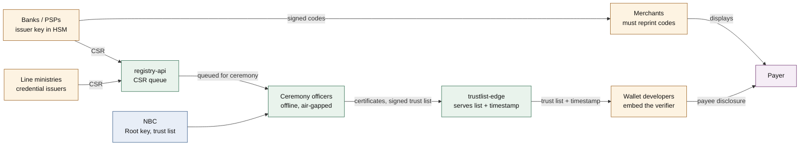
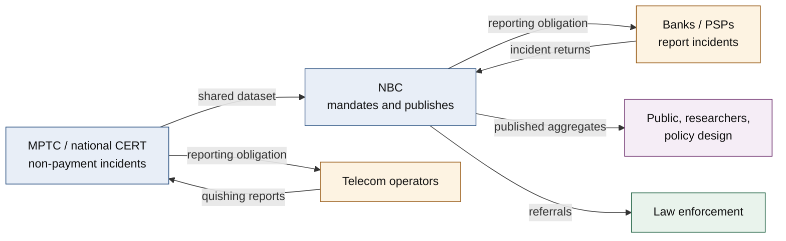
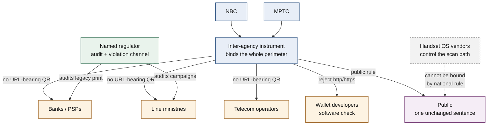
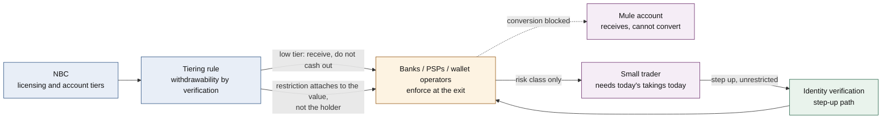
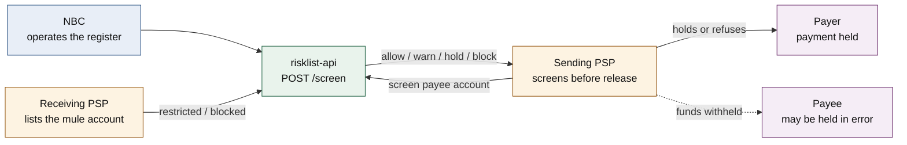
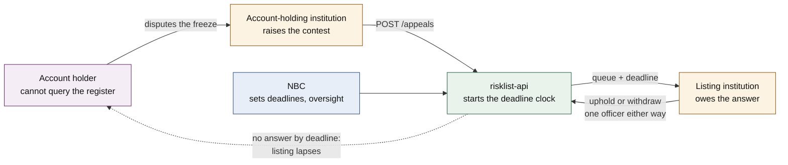
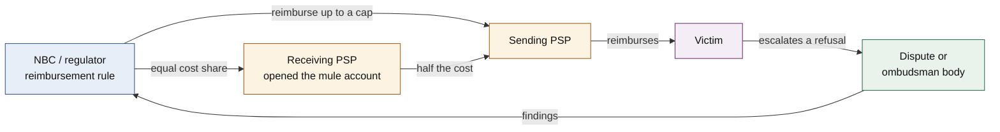

# QRSeal

A reference implementation of **KH-SQR**: signed QR codes for Cambodia. A
payment profile that binds an ECDSA signature to an existing KHQR/EMVCo payload,
a credential profile for signed documents, and the institutional services behind
them.

TypeScript, Web Crypto only, Cloudflare Workers. MIT licensed.

---

## Read this first

**QRSeal addresses forgery. It does not prevent authorised push payment fraud,
which is the dominant vector, and nothing built on it should suggest otherwise.**

A verified signature is not a reason to pay. The API is built so that this is
hard to forget: verification never returns a boolean, and the credential result
has no `isValid` accessor, precisely so a caller cannot reach a verdict without
handling the fields that would catch a fraud.

The rest of this document says exactly what that means, problem by problem.

---

## 1. The problems that exist now

Cambodian QR fraud is not one problem. It is at least eight, and they fail in
different places. Conflating them is how a scheme gets sold as solving more than
it does.

| # | Problem | What actually happens |
|---|---|---|
| **P1** | **Overlay forgery** | A sticker carrying the attacker's QR is pasted over a merchant's code. The customer pays a stranger; the merchant is never paid. |
| **P2** | **Forged official codes** | A printed code on a fake notice, certificate or document, claiming to prove the document is genuine. |
| **P3** | **URL-bearing QR (quishing)** | Scanning opens a website that harvests credentials, one-time codes, or a card payment. |
| **P4** | **Genuine code, false pretext** | A *real*, correctly registered, correctly signed KHQR presented with a lie: "scan to receive your refund", "scan to release your parcel". The victim authorises the payment themselves. This is **authorised push payment (APP) fraud**. |
| **P5** | **Registration abuse** | A criminal registers a merchant account with genuine or purchased identity documents and receives a genuine key. Their codes are authentic. |
| **P6** | **Counterfeit verifier** | A fake wallet application that displays a green tick for anything. |
| **P7** | **Transplanted credential** | A genuine QR photographed from a real certificate and printed onto a forged one. The signature still verifies; nothing about the paper is signed. |
| **P8** | **Mule cash-out** | Funds arrive in a real account and are forwarded within minutes. Push payments are final; there is no chargeback. |

Two structural facts make these hard:

- **A QR code is not human-readable.** There is no equivalent of noticing a
  misspelled domain, because there is no visible domain.
- **KHQR's success collapsed the meaning of "QR".** For much of the public, QR
  *is* payment, and payment *is* sanctioned by the central bank. That
  expectation extends far beyond what anyone actually controls, and attackers
  work in the gap.

---

## 2. What QRSeal solves

| Problem | Status | How |
|---|---|---|
| **P1** Overlay forgery | **Solved at the code layer** | An attacker without a registered issuer key cannot produce a payment code that verifies, and cannot alter a genuine one by a single character. |
| **P2** Forged official codes | **Solved at the code layer** | Profile B credentials are signed by a registered issuer against a Root-anchored trust list. An unsigned or altered credential fails. |
| **P7** Transplanted credential | **Made detectable, and hard to skip** | Verification returns `mustMatchPrintedDocument` — subject name, document id, issuing organisation, issue date — and offers no boolean. A caller cannot reach a verdict without the comparison, and a test asserts no boolean member exists, so a later refactor adding a convenience accessor fails the build. |

"Solved at the code layer" is a precise claim, not a rhetorical one: within the
standard cryptographic threat model, forgery of the *artefact* is closed. It says
nothing about the layers above it — see **P6**, where a counterfeit verifier
defeats all of this without breaking any cryptography.

**A benefit that is easy to miss.** After QRSeal, an overlay attack that
*verifies* requires a registered merchant account. That means an identity went
through onboarding, an account number is embedded in the code, the account can be
listed within minutes, and the funds are traceable and freezable. The attack does
not become impossible — it becomes expensive, non-repeatable and attributable.
That attribution is what the institutional layer (§4) runs on.

**And a cost that is easy to miss.** Every signed code a person scans
successfully teaches them that *the system checks these for me*. That raises
what the public is willing to trust. It does not extend what anyone actually
controls, because P4 is untouched by any of it. **Deploying QRSeal should be
expected to reduce forgery and to increase exposure to authorised push payment
fraud** — and with no incident data, nobody will learn the sign of the sum. See
§3.9.

---

## 3. What QRSeal cannot solve

For each, the reason it is unreachable from the code layer — not merely that it
is.

### P4 — Authorised push payment fraud · **not addressed at all**

The dominant vector. A genuine code, correctly signed, payable to a correctly
registered account, presented with a false story. **A correct implementation of
this specification verifies such a code, and must.** Every byte is authentic.

*Why unreachable:* there is no forgery to detect. The falsehood lives in the
sentence spoken or printed above the code — not in the payload, not available to
the verifier, and not signable by anyone even in principle. No party is in a
position to attest to the truth of an arbitrary claim about why a payment is
owed.

*One subset is reachable, and the difference is not in the lie.* P4 divides on
whether the payee account is shown to one victim or to many. A pretext built for
a single victim consumes the account and abandons it, and no register will be
populated while it still matters. A pretext that is a **standing offer** — goods
advertised and never sent, a service sold and never delivered — must present the
same payee to every victim it recruits, because a fresh account per victim costs
an identity. That kind accumulates reports against a stable identifier *while it
is still operating*, which is the only condition under which a risk list does
anything. No verifier can tell the two apart; both are genuine. The distinction
is visible only in aggregate, across victims — to an institution, never to a
payer. This is why [§4.4 screening](#44-screen-at-the-moment-of-payment--built)
reaches *part* of P4 rather than none of it, and why **time-to-list**, not
detection accuracy, is the metric. We claim nothing about how large that subset
is in Cambodia; [nobody publishes the data](#41-publish-incident-data--first-because-everything-else-depends-on-it).

### P5 — Registration abuse · **not addressed**

*Why unreachable:* the signature attests an identity that is genuinely real. Its
truthfulness is not in question; its *legitimacy* is, and legitimacy is a fact
about intent and history, not about bytes. Nothing computable from the payload
distinguishes a real merchant from a real criminal who completed the same
onboarding.

### P3 — URL quishing · **partly addressed, and this is the weaker half**

QRSeal rejects `http`/`https` payloads, and exposes that check for use on *every*
scanned code, not only KH-SQR ones.

*Why that is not enough:* a code scanned with the handset's native camera
application never reaches any verifier, and that is how a great many codes are
scanned. The software check binds implementations; it cannot bind an attacker's
printer. Closing it in software would require Apple and Google to ship a
Cambodia-specific rule. See §4.2 for the half that does the work.

### P6 — Counterfeit verifier · **partly addressed, weakly**

An application trust list helps a user who checks what they installed, and does
nothing for a user who installed from a link in a message.

*Why it disappoints:* Schechter et al. (IEEE S&P 2007) found that of the 25
participants using their own bank accounts, 23 entered their passwords after the
site-authentication image they had themselves chosen was removed. Users do not
reliably notice a *missing* positive indicator. Any scheme whose safety rests on
"the user will notice the tick is gone" rests on an assumption that has been
tested and did not hold.

### P8 — Mule cash-out and layering · **not addressed by the code**

*Why unreachable:* by the time funds move, the payment is final and irreversible.
Addressed partly at the institutional layer (§4.3 and §4.4), and only for the first hop.

### 3.9 The gap widens over time — and this design widens part of it

The eight problems above are stated as of now. The direction matters more.

Two boundaries govern this system: what the authorities actually control and can
vouch for, and what the public extends central-bank trust to. The distance
between them is where every attack in §1 operates — and it is not static.

**The trust boundary grows linearly**, bounded by administrative capacity: one
issuer registered, one code signed, one credential type covered at a time.

**The credulity boundary grows with habituation and never contracts.** Five
mechanisms, each running one way only:

1. **Late adopters inherit QR as furniture.** Early users met it as a novel
   instrument and learned some caution. Every later cohort receives it already
   normalised, and learns none.
2. **Every uneventful scan strengthens the prior.** The base rate of safe scans
   stays overwhelming even as fraud rises, so ordinary experience keeps
   confirming that scanning is safe. Individual evidence and population risk move
   in opposite directions.
3. **Attacker learning is cumulative and shared; victim learning is neither.** A
   pretext that works becomes a template. Having been defrauded propagates
   poorly, because shame suppresses the telling.
4. **Value at risk per account rises** as salary, bills and remittances move onto
   the rail. Same attack, larger yield, no extra effort.
5. **The substrate does not improve on its own.** Finality and the liquidity of
   the output (§4.3) are fixed unless deliberately changed, so loss per incident
   stays at maximum.

**QRSeal contributes to the fifth column of that ledger.** A measure that
manufactures precisely the confidence the dominant attack feeds on is not a
neutral addition. This is the SiteKey result (P6) in dynamic form: users do not
reliably notice an indicator that is *absent*, and they do generalise from one
that is *present*.

**The trajectory is not observable.** With no baseline there is no trend. A
country without incident statistics cannot detect a gradual rise in fraud it does
not measure; the first reliable signal is a crisis, not a gradient. This is the
strongest form of the argument in §4.1 — without measurement, none of this can be
observed even in principle.

**What follows for the ranking in §4.** If exposure grows, interventions do not
age equally:

- **Detection-dependent controls degrade with volume.** Screening (§4.4) needs
  someone to have listed the account; contest (§4.5) needs officers to answer in
  time. Both spend institutional effort against attacker volume, and lose.
- **Substrate controls are volume-independent.** Exit controls (§4.3) do not care
  how many attacks occur — illiquidity applies identically at ten incidents or
  ten thousand, and costs no more at either.

So a rising trajectory pushes the ranking *further* toward the substrate and away
from detection.

**What kind of claim this is.** A mechanism argument, not a forecast. Each
mechanism is structural and one-directional, so the *direction* is determined.
The magnitude is not, and with no incident data it can neither be estimated nor
currently observed. No number is predicted here, and one should be distrusted.

---

## 4. How to solve what QRSeal cannot

Ranked by expected effect. Note how little of it is cryptography.

| Priority | Intervention | Reaches | Status in this repo |
|---|---|---|---|
| **1** | Mandatory incident reporting, published aggregates | Everything — makes prioritisation arguable at all | **Policy. Not built.** |
| **2** | Categorical prohibition on URL-bearing QR codes | P3 | **Half built** — software check in `SPEC.md` §3.2; the rule itself is policy |
| **3** | Exit controls on cash-out | P4, P8 | **Policy + account infrastructure. Not built.** |
| **4** | Time-to-list, plus screening at the moment of payment | P4, P8 | **Built** — `risklist-api` |
| **5** | The right to contest a listing | Wrongful listings | **Built** — `risklist-api` |
| **6** | Liability allocation | P4 incentives | **Policy. Not built.** |
| **7** | Onboarding quality (know-your-customer) | P5 | Out of scope here |
| **8** | Verification inside the OS scan path | P3, P6 | Not nationally achievable |

### 4.1 Publish incident data — first, because everything else depends on it

There is **no reliable Cambodia-specific QR fraud data**. The figures in
circulation (a "146% Q1 2026 quishing surge" and similar) are vendor telemetry
with undisclosed denominators and no Cambodian breakdown. This repository relies
on none of them.

The absence is itself a finding. Without incident statistics, nobody can
demonstrate that forgery is rarer than deception — which is the claim this project
argues on structural grounds and would much rather argue from evidence. Mandatory
reporting for payment institutions, with published aggregates, would do more for
the design of countermeasures than any cryptographic improvement, **including this
one**.

### 4.2 Prohibit URL-bearing QR codes, categorically

Two asymmetric halves, because the population that bears the rule and the
population that bears the obligation are different, and each gets the form of
instruction it can actually follow:

> **Public rule.** A QR code never opens a website. If a website opens, it is a
> scam: do not pay, and do not enter your PIN, password, one-time code or
> personal details.

> **Institutional prohibition.** No licensed bank, payment institution,
> government body or telecommunications operator shall issue, publish or display
> a QR code whose payload is an `http` or `https` URL.

The public half is categorical and requires no judgement: it is evaluated on an
observation — a browser opened — that anyone can make. The institutional half is a
compliance obligation, which institutions can follow because they have compliance
functions and the public does not.

**Why it must not be scoped.** A rule limited to "payments and official
communications" would require a person to classify a code *before* acting on it.
But a QR code is not human-readable, so its class is knowable only after
scanning — which is after the browser has already opened. A rule with an exception
is a rule that cannot be applied.

**Why nothing else reaches P3.** Every alternative fails at the same point: it
needs a judgement before or during the scan, or control over software the state
does not have.

| Alternative | Asks the user to | When | Fails because |
|---|---|---|---|
| Wallet-only scanning | Pick the right application | Before | The code's class is unknowable until it has been scanned |
| Show the destination domain | Read and compare a string | During | The judgement people demonstrably cannot make |
| In-wallet domain allowlist | Nothing | During | Bypassed entirely by the native camera |
| OS camera integration | Nothing | During | Not in national control; not on the cheap handset base |
| Education without a categorical rule | Apply conditions | Before | Conditions are the thing that fails |
| Confirmation of payee | Check a name | After | Addresses the pretext, not the URL channel |

Only the categorical rule is evaluated *after* the scan.

**What it does not do:** it closes a channel; it does not reduce the adversary's
budget. Effort displaces to P4, which is already dominant and which this rule
leaves entirely intact.

### 4.3 Remove the convertibility of the proceeds — exit controls

The QR substrate has two independent properties that govern fraud exposure, and
Cambodia holds the worse value of both:

| | **Finality of the transfer** | **Liquidity of the output** |
|---|---|---|
| **Cambodia (Bakong)** | Final. No party can reverse. | **Money.** Withdrawable as cash, forwardable, convertible. |
| **Japan (code payments)** | Reversible. An operator holds the ledger. | **A claim** redeemable through a chokepoint the operator owns. |

Finality is not available to change — it is why Bakong exists, and §8 of the
paper records what it bought. **That leaves liquidity as the one substrate
property still open, and it is the more consequential of the two.**

Fraud is a business and the business needs an *exit*. Reversibility only helps
if somebody notices in time, so it inherits every weakness of detection.
Illiquidity attacks the economics directly: if the proceeds cannot become cash,
the scheme does not pay whether or not anyone detects it, whether or not the
victim is believed, and whether or not any account was ever listed.

Japan's version is **statutory, not a product choice**, which is what makes it a
policy instrument rather than an architectural accident. The Payment Services
Act separates prepaid payment instruments from funds transfer services; refund
of a prepaid balance is generally prohibited, and a scheme designed to permit
general refunds risks reclassification into the heavier licence. PayPay
accordingly distinguishes a verified, withdrawable balance from an unverified,
non-withdrawable one — and value loaded as the non-withdrawable kind **stays**
non-withdrawable even after the holder later completes identity verification.
The restriction attaches to the value at the moment it arrived, not to the
holder's current status, so past receipts cannot be liberated by upgrading the
account afterwards. Worth copying exactly.

Three forms, in increasing order of friction:

- **Withdrawability tiered by verification.** A low-tier account may receive
  freely but cannot cash out above a threshold without stepping up.
- **A cooling window on onward transfer** of recently received funds, for
  accounts in a defined risk class.
- **Velocity limits** on newly opened accounts, and on accounts receiving from
  many unrelated payers for the first time — the signature of a mule account,
  visible without knowing anything about any particular payment.

**Why this ranks above screening.** Screening (§4.4) protects nobody until an
account has been listed, so every victim between the first fraudulent receipt
and the first listing is unprotected by construction — and those are precisely
the victims that make a fresh mule account worth opening. Exit controls bind
from the first receipt. The two are **complements, not alternatives**: exit
controls cover the window screening cannot reach.

**The cost is serious and lands on the wrong people.** Exit friction is friction
on cash flow, and small traders live on cash flow. A market seller who needs
today's takings today is exactly who Bakong was built to serve. Any workable
design must bind a *risk class* — new account, no history, anomalous inbound
pattern — and leave an established merchant untouched. A control felt by ordinary
users and merely irritating to criminals gets routed around, relaxed, and
eventually removed, having cost something in the meantime.

### 4.4 Screen at the moment of payment — built

A register nobody consults before releasing money is a record of the fraud, not a
control on it. `risklist-api` exposes `POST /screen`, returning a **decision**
rather than a raw status, because a scheme in which one bank holds where another
releases is not a scheme:

| Status | Action | Character |
|---|---|---|
| `clear` | Execute | — |
| `restricted` | Hold: delay, or route to manual review | Prudential, reversible, expires in 72h |
| `blocked` | Refuse | Standing assertion, two officers |

A low-value carve-out exists and **defaults to zero in every currency**, so an
unconfigured deployment does the safe thing and a regulator wanting less friction
must choose the threshold and own it.

**Privacy:** only decisions with a consequence are recorded, and the payer is
never identified to the service. Whether an account was listed at a given moment
is already reconstructable from the append-only change feed, so recording cleared
payments would buy nothing and build a national record of who paid whom.

**Limits, stated plainly:** it catches accounts *already listed* — victims before
the first listing get nothing, which is why **time-to-list**, not detection
accuracy, is the operative metric. It sees the first hop only. It sits in the
payment path, so if it is slow, institutions will route around it.

### 4.5 The right to contest a listing — built

A national register that can freeze a real person's money needs a way for that
person to be wrong about.

- The customer **cannot query the service** — an open lookup would tell a mule
  operator whether their account had been detected. Their own bank contests on
  their behalf.
- Raising a contest **does not change the status**. No institution clears a
  suspicion by asserting that it is disputed.
- **An unanswered contest lapses the listing** — 24h for a restriction, 72h for a
  block, evaluated at read time like the expiry. Silence favours the account
  holder, because they are the party who cannot act.

This corrected a real defect: a restriction took one officer to impose and two to
remove, making an error more expensive to correct than to make. Answering now
takes one officer either way; the two-officer rule remains on discretionary
removal by an institution that did not make the listing.

**Open problem:** the listing institution is disclosed to the account-holding
bank, not to the customer — preserving the contest without breaking the
tipping-off constraints anti-money-laundering regimes impose, but leaving the
affected person unable to learn who listed them or on what evidence. We do not
think this is satisfactory and have no better answer.

### 4.6 Allocate liability — policy, not built

The UK has required reimbursement of in-scope APP scam victims up to £85,000
since 7 October 2024, **split equally between sending and receiving institution**.
The equal split is the substantive choice: it gives the receiving bank — which
opened the mule account and is best placed to detect it — a direct financial
interest in the quality of its own onboarding.

We note the precedent rather than recommending transplantation; a cap calibrated
to UK incomes means nothing elsewhere. What transfers is the principle that
liability should rest where the cheapest available control is, and that leaving
the entire loss with the payer allocates it to the party least able to prevent
it.

---

---

## 5. Stakeholders

No single organisation can deliver any of the interventions above. Each needs a
different combination of parties, and the ones that matter most need parties
outside the central bank's perimeter. This section names them.

Four roles recur:

| Role | Meaning |
|---|---|
| **Mandates** | Has the authority to require the change |
| **Operates** | Runs the machinery |
| **Complies** | Must change what it does |
| **Bears the outcome** | Experiences the result, and usually cannot act alone |

And one category that matters because it is *absent*: handset operating-system
vendors, who control the scan path and cannot be bound by Cambodian rule.

### Who must act, per solution

| Solution | Mandates | Operates | Complies | Bears the outcome |
|---|---|---|---|---|
| **S0** QRSeal signing | NBC | Root ceremony, `trustlist-edge`, `registry-api` | Banks/PSPs, ministries, merchants, wallet developers | Payers, document verifiers |
| **S1** Incident reporting | NBC, MPTC | NBC statistics function | Banks/PSPs, telcos | Public, researchers, policy |
| **S2** URL prohibition | NBC + MPTC + line ministries | Named regulator (audit) | Banks/PSPs, ministries, telcos, wallet developers | Public |
| **S6** Exit controls | NBC (licensing + account tiers) | Account-holding institutions | Banks/PSPs, wallet operators | Account holders, small traders |
| **S3** Screening | NBC | `risklist-api` | Sending and receiving PSPs | Payers, payees held in error |
| **S4** Right to contest | NBC | `risklist-api` | Account-holding and listing institutions | Account holders |
| **S5** Liability allocation | NBC / regulator | Dispute or ombudsman body | Sending and receiving PSPs | Victims |

### S0 — QRSeal signing (solves P1, P2, P7)



The cost lands on **merchants**, who must reprint at a larger symbol size, and on
**wallet developers**, who must ship a verifier. Neither is the party that
benefits most, which is the adoption problem in one sentence.

### S1 — Mandatory incident reporting (priority 1)



The smallest stakeholder set of any intervention here, and the one that makes
every other priority arguable from evidence rather than from structure.

### S2 — Categorical URL prohibition (priority 2)

Two asymmetric halves. The prohibition binds institutions; the rule addresses the
public. Both are needed, and the software check is the weakest of the three.



**The critical dependency is the inter-agency instrument.** NBC alone binds banks
and PSPs. One ministry running a URL-QR campaign falsifies the public rule for
everyone, and the public cannot be asked to hold an exception — so MPTC, line
ministries and telcos must be inside the same instrument or the rule is not true.

### S6 — Exit controls on cash-out (priority 3)



This is the only intervention that acts on the **fraudster** rather than on the
payer, the payee or the code. It also has the sharpest collateral cost: the same
friction that traps a mule's proceeds delays a market seller's takings, which is
why the tier must bind a risk class and not everyone.

### S3 — Screening at the moment of payment (priority 4, built)



The **receiving PSP** is the load-bearing party: it sees the account behaviour
first and nothing works until it lists. That is also why liability allocation
(S5) matters — it is the party with the information and, today, none of the cost.

### S4 — The right to contest a listing (priority 5, built)



The account holder appears only at the two ends of this diagram: they start the
contest and they receive its outcome, and they touch nothing in between. That is
deliberate — an open lookup would tell a mule operator whether they had been
detected — but it is also why the **dotted lapse arrow** matters. It is the only
path in the diagram that protects the account holder without requiring any other
party to act.

### S5 — Liability allocation (priority 6, policy, not built)



The **equal cost share** is the whole mechanism. It routes part of the loss to
the receiving PSP, which is the party holding the information S3 depends on. A
sender-pays rule leaves that party with the detection capability and none of the
incentive.

### Where the stakeholder analysis lands

- **NBC cannot deliver S2 alone.** It is the only intervention here requiring an
  instrument that reaches outside the financial perimeter, and it is priority 2.
- **The receiving PSP is load-bearing twice** — it lists accounts (S3) and it
  holds half the loss (S5). Those two facts should be designed together.
- **Merchants pay for S0 and benefit least**, which is where adoption will stall.
- **Only S6 acts on the fraudster.** Everything else acts on the payer, the
  payee, the code or the institutions. That is worth noticing when ranking.
- **The public is asked for exactly one thing** in the entire programme: the
  single sentence in S2. Everything else is asked of institutions. That is the
  correct distribution, and any design that inverts it is asking the wrong party.


## 6. What is here

```
packages/core/         isomorphic library. Web Crypto only. What a wallet embeds.
  src/base45.ts        RFC 9285
  src/cbor.ts          minimal strict encoder/decoder, fixed claim shapes only
  src/cose.ts          COSE_Sign1 over ES256
  src/emvco.ts         TLV parse/serialise, CRC-16/CCITT-FALSE
  src/kid.ts           key identifier derivation
  src/profileA.ts      payment: sign, verify
  src/profileB.ts      credential: sign, verify
  src/trustlist.ts     list validation, timestamp statement, rollback + staleness
  src/errors.ts        one class per normative rejection reason
packages/cli/          sign, verify, build-trustlist, build-timestamp, run-vectors
workers/
  trustlist-edge/      serves trust list + timestamp statement (read-only)
  registry-api/        CSR intake, queued for the offline ceremony
  risklist-api/        Annex C: risk list, screening, appeals
vectors/vectors.json   language-neutral conformance suite
docs/                  measurements, source verification
paper/                 the preprint
```

`SPEC.md` is the normative specification, including **Annex C** for the risk
list, screening and appeals.

## 7. Usage

```bash
pnpm install
pnpm build
```

Verify a payload:

```bash
node packages/cli/dist/index.js verify \
  --payload @payload.txt \
  --trustlist @trustlist.json --root-keys @root-keys.json \
  --timestamp @timestamp.json --timestamp-keys @timestamp-keys.json
```

Exits 0 with the attestation, or 1 with a stable machine-readable rejection
reason. Signing:

```bash
node packages/cli/dist/index.js sign-a \
  --payload '000201010212…6010PHNOM PENH' \
  --key issuer.key.pem --kid 27403764C95F4F5B \
  --payee-class M --expires-at $(( $(date +%s) + 60 ))
```

In code:

```ts
import { TrustAnchor, verifyProfileA } from '@kh-sqr/core';

const anchor = await TrustAnchor.open({
  trustList, timestamp, rootKeys, timestampKeys, heldVersion, fetchedAt, now,
});

// Throws a KhSqrError carrying a stable `reason` on any rejection.
const attestation = await verifyProfileA({ payload, trustAnchor: anchor, now });

// Show this to the payer. The signature says these values were not altered.
// It does not say the person in front of them is who they think.
showBeforeAuthorising(attestation.payeeDisclosure);
```

Prove a port conforms, without reading any of this TypeScript:

```bash
node packages/cli/dist/index.js run-vectors --file vectors/vectors.json
```

## 8. Design decisions worth knowing

**The signing input is a prefix.** Profile A signs from position 0 up to and
including the five characters `99128`. A verifier recovers it with a substring,
never by re-serialising parsed fields — so there is no canonical form to disagree
about and no canonicalisation bug to have.

**Raw r-concat-s, never DER.** `crypto.subtle.sign` returns IEEE P1363 raw
`r||s`, exactly what the wire format carries. No conversion step anywhere, so no
DER length-parsing bug. DER is rejected with its own reason.

**Uppercase hex, never base64.** QR alphanumeric mode admits only uppercase
letters, digits and nine punctuation marks; one lowercase character forces a
byte-mode segment.

**Profile A depends on nothing but Web Crypto.** No CBOR, no streams, no
packages, so a wallet can embed it with no polyfill. Its import graph reaches six
modules and CI fails if it reaches another kind.

**CBOR is hand-written and strict.** A general library is a large audit surface
on a security-critical path for no benefit at this complexity. Differentially
fuzzed against a reference implementation in CI; rejects indefinite lengths,
non-minimal integers, floats, duplicate keys and trailing bytes.

**No signing key exists at the edge.** Workers serve signed artifacts and verify
signatures. The Root signs offline, issuer keys live in each institution's HSM,
the timestamp statement is produced outside Cloudflare and uploaded. This is the
specification, not caution: issuance must be impossible through compromise of the
online portal. CI fails if a signing key appears in any Worker file.

**The risk list does not use KV.** Eventual consistency leaves a window in which
a just-listed account still reads clear — the window a mule account is drained in.
A Durable Object per shard serialises reads and writes; D1 remains the authority.

**Statuses expire at read time.** A stored deadline compared against the clock
when someone asks, never a cron sweep. A missed sweep would silently extend a
restriction on a real person's account, invisibly to them and to the institution.

## 9. Measured QR symbol sizes

Error-correction level M. Generated by `pnpm measure:qr`, not transcribed.

| Payload | Chars | Version | Modules | Encoding mode |
|---|---|---|---|---|
| Unsigned KHQR baseline | 111 | 5 | 37 x 37 | numeric + byte + alphanumeric |
| Profile A signed | 317 | 10 | 57 x 57 | numeric + byte + alphanumeric |
| Profile B credential | 381 | 12 | 65 x 65 | alphanumeric |
| Unsigned, uppercase acquirer id | 111 | 5 | 37 x 37 | numeric + alphanumeric |
| Profile A, uppercase acquirer id | 317 | 10 | 57 x 57 | numeric + alphanumeric |

Signing takes a merchant code from version 5 to version 10: 54 per cent more
linear dimension, 2.4 times the module count. At fixed module size the sticker
grows; at fixed sticker size the modules shrink and scan less reliably on a cheap
handset in poor light. **This cost falls on merchants, who must reprint** — an
adoption problem no cryptographic elegance addresses.

## 10. Where this repository does not conform to its own specification

**Mirror independence.** `SPEC.md` §4.4 requires three mirrors under *distinct
operational control*. This deployment is one provider — one account, one
governance failure. `trustlist-edge` is the **primary**, not a conforming mirror
set. **No conformance to §4.4 is claimed**, and the service's health endpoint
says so.

**Legacy transparency.** `SPEC.md` §2.4 records two deviations from EMVCo:
template `85` carries 201 characters where EMVCo length fields hold at most 99,
so three-digit lengths are used; and EMVCo requires a Globally Unique Identifier
at sub-tag `00`, where KH-SQR puts a format version. A strict legacy parser will
therefore *fail* on a signed payload rather than ignoring it. Deployment must
upgrade parsers, not merely signers.

## 11. Reproducing the reference vectors

Every key comes from a published scalar or a published label, so the suite
regenerates from this repository alone:

```bash
pnpm build && pnpm vectors:generate
```

The published issuer scalar is deliberately public and protects nothing; its key
identifier is `27403764C95F4F5B`. ECDSA is randomised, so regeneration produces
different signatures — `pnpm vectors:check` compares the case inventory, not
bytes. The published Profile B payload came from a different deflate
implementation and is a `verify` case: conformance requires that it decodes and
verifies, not that your encoder reproduces it.

## 12. Development

```bash
pnpm check:all      # typecheck, lint, tests, vectors, both architectural guards
pnpm test           # core: 97 tests including the 41-case conformance suite
pnpm --filter @kh-sqr/risklist-api test   # workers run in workerd, not a shim
```

The conformance suite is 40 cases, 31 of them negative. Negative cases are the
point: an implementation that accepts a well-formed payload has demonstrated very
little; one that rejects each malformation for the right stated reason has
demonstrated most of the specification.

## Licence

MIT. See `LICENSE`.

## Citation

The preprint is in `paper/`, and cites a specific tagged commit of this
repository.
